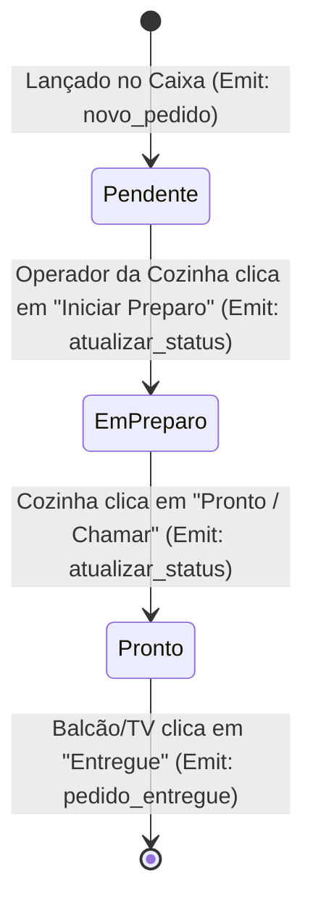

# Especificação de Arquitetura e Fluxo de Dados

## 🏗️ Topologia da Aplicação

```mermaid
graph TD
    subgraph Multi-Dispositivos em Rede Local (Wi-Fi)
        A[Navegador Caixa 1]
        B[Navegador Caixa 2 / Celular]
        C[Monitor Cozinha KDS]
        D[TV Balcão Chamada]
    end

    subgraph Backend Node.js (Servidor Local)
        E[Express HTTP Server - Porta 3001]
        F[Socket.io WebSocket Engine]
        G[Gerenciador de Estado de Pedidos]
        H[Persistência Local JSON - backend/data/]
    end

    A -- REST API / WebSocket --> F
    B -- REST API / WebSocket --> F
    F -- Socket Event: novo_pedido --> C
    C -- Socket Event: atualizar_status --> F
    F -- Socket Event: pedido_pronto --> D
    F <--> G
    G <--> H
```

---

## 🔁 Fluxo de Vida do Pedido



---

## 💾 Estrutura dos Arquivos de Dados Local (`backend/data/`)

1. `orders.json`: Armazena a lista completa de pedidos ativos e histórico recente.
2. `menu.json`: Cadastra as categorias e itens do cardápio com preços e opções.
